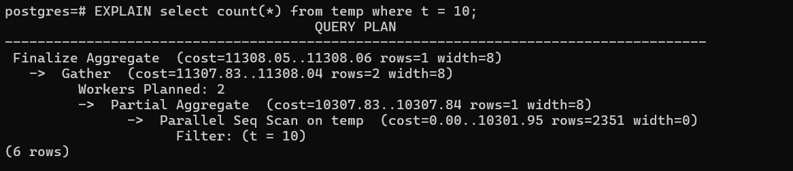

Indexing in database simply means creating a data structure that allows you to get the data you want quickly.
###### Two types of Index are there:
1. B-Trees
2. LSM Trees

###### Index creation
```sql
CREATE INDEX index_name ON table_name (column_name);
```
On creating index using create index command, It creates B tree, building B3 bitmap index on top of all the stuff.


###### Explain command
It helps us to identify what query plan postgres going to use for executing given SQL query.

Result of and explain query command as show below (in postgresql)


very few first words after using explain command:
* shows type of scanning done (ex: Parallel Seq Scan) by postgres to fetch data.
* **cost:** ex: 0.00...289025.15, rows = ?, width = ? (all columns total width)
  * 0.00 --> the attempting of work before fetching the row from disk. ex: order by (sorting)
  * 289025.15  --> Estimation of total time going to take to fetch the result
  * rows --> Estimation of total rows going to be fetched by the query
  * width --> in the EXPLAIN query output represents the average number of bytes each row in the result set is estimated to occupy

###### Scan Types
1. Sequential Table scan
   * Parallel Sequential Table scan
2. Index Scan
3. Bitmap Index Scan (specific to Postgres)

Question: When DB goes for sequential scan, bitmap index scan  or index scan? --> Read [here](https://www.percona.com/blog/one-index-three-different-postgresql-scan-types-bitmap-index-and-index-only/)

###### Index scan and Index only scan
Index scan consists of two steps:
1. Firstly finds the location of applicable rows using index on filtering columns
2. Fetch the data from Heap or table pages

**Index Only scan:** It's a smart way to reduce the step 2 of index scan if all the retrieved columns from query exist in the index itself.
However, we can include a non-key attribute while creating index on particular attributes.
for ex:
```sql
create index <INDEX_NAME> on <TABLE_NAME>(indexed_columns) include (non-index column);
```

**Note:** In `include`, not include all the remaining columns as it will create a larger tree, and query performance will be degraged and no purpose of creating the index.


**Composite Index:** When an index is made up using two or more attributes. Suppose, three columns a, b and c are in a table.
compositeIndex ex: Indexing on (a, b). Indexing on (b, a), Indexing (a, b, c) etc.

**Note:** `It matters what attribute we keep on the leftmost side of the composite index.` So, suppose, index is (a, b). and query is happening `where a = 10`. then DB will use index of (a, b) as on leftMost side a exist.

Either complete But, if query is using `where b = 90`, then this composite index will not be used.


###### Creating index concurrently
Creating index concurrently, so that production read and write doesn't get blocked while creating index.
For this, Postgres provides a keyword `concurrently` to be added in the create index query.

**Pros:**
* Read, Write doesn't get blocked which is essential as live user shouldn't be affected.

**Cons:**
* Due to this, CPU usage can be increased because insert, update might happen during index creation, and it becomes secondary priority to create index.


###### Searching on billion row table: ways
1. Brute Force searching (can be sequential, parallel sequential etc)
2. Indexing (Index scan, Index only scan, Bitmap index scan)

Using the second option, we can reduce the searching operation on number of rows or can reduce the operational data. can we reduce further this operational data?
Here, `Partitioning` plays a good role to chunk data.


###### Partitioning
Partitioning (Horizontal) means `Divide the table into multiple chunks (such as rows 1...k are at t1 location, k+1....n are at t2 location and so on).`
Now, what partition to search at time of query. It can be done using `Partition Key.`

Ques: A long transaction that has updated millions of rows rolls back, then the new row versions created by this transaction (millions in my case) are now invalid. You have many ways to address this, do you clean all dead rows eagerly on transaction rollback? Or do you do it lazily as a post-process? Or do you lock the table and clean those up until the database fully restarts?

Ans: Postgres uses `Lazily approach called vaccum` --> Remove dead rows from to free up the space. Other DBs use eager approach.